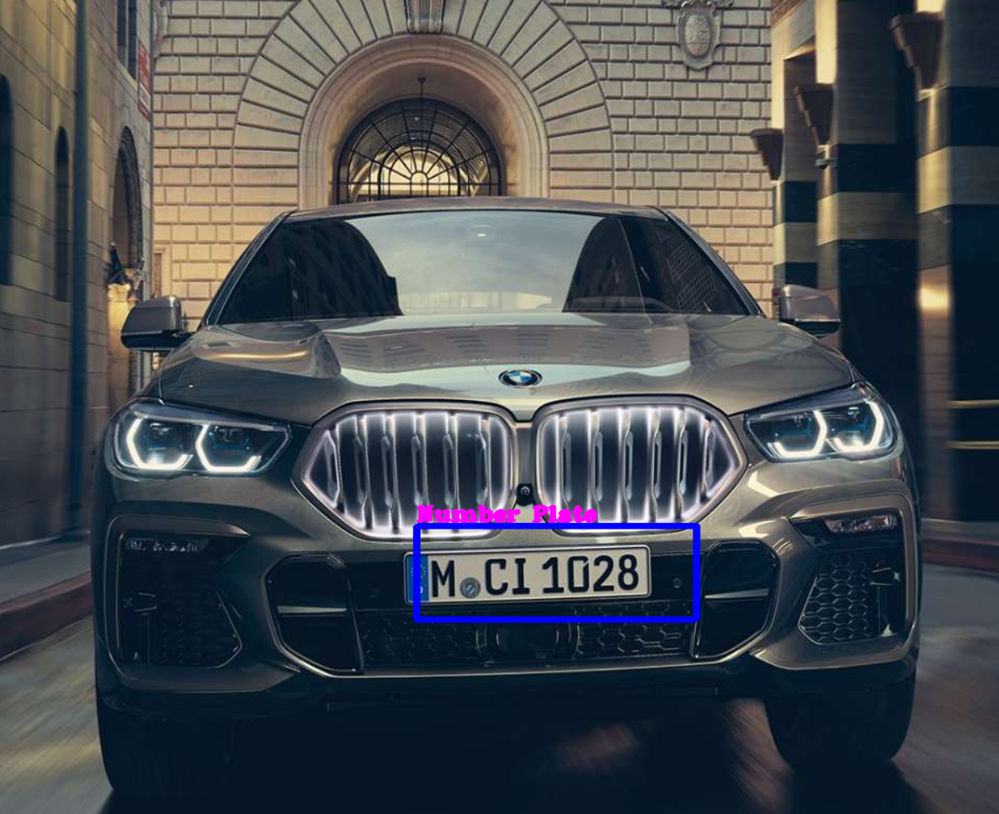
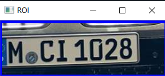

# Car-Number-Plate-Detection-OpenCV-Python
Detection of number plate on car using openCV

## Original Car Picture

## GrayScaleImage

## Number Plate Detection Image

## Number Plate on different Screen

